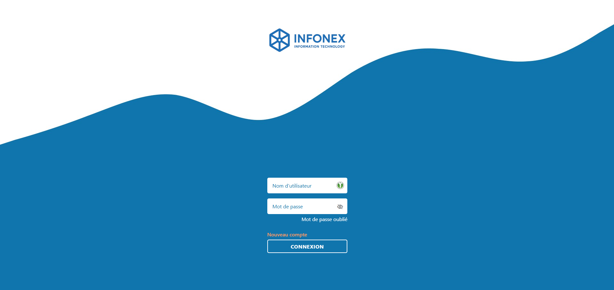

# appli_web_gestion_ticket

Application Symfony de **gestion de tickets** (support et demandes techniques).

- **Administrateur** : consulter et traiter les tickets, répondre aux utilisateurs, modifier le statut des tickets (en attente, en cours, résolu), créer des comptes administrateurs, consulter les statistiques (répartition des tickets par catégorie).
- **Utilisateur** : créer un compte, créer des tickets (incident ou demande), suivre l’avancement des tickets, répondre aux échanges, consulter l’historique, recevoir des notifications par email.
- **Système** : authentification sécurisée, notifications automatiques par email, archivage et traçabilité des tickets.

Backend : Symfony (PHP 8.4 – FrankenPHP)  
Frontend : HTML5, CSS, JavaScript (AJAX, Axios)  
Bases de données : MariaDB (SQL) + MongoDB (NoSQL)  
Déploiement local : Docker

Lien en ligne : https://support.joeldermont.fr
---

## Aperçu



---

## Prérequis

Avant de commencer, installez :

- [Docker Desktop](https://www.docker.com/products/docker-desktop/)
- [Git](https://git-scm.com/)

### Activer et installer WSL2 (Windows uniquement)

Si vous êtes sur **Windows**, activez **WSL2** (Windows Subsystem for Linux) pour une meilleure compatibilité Docker/Symfony :

1. Activez WSL et la virtualisation :
   ```powershell
   dism.exe /online /enable-feature /featurename:Microsoft-Windows-Subsystem-Linux /all /norestart
   dism.exe /online /enable-feature /featurename:VirtualMachinePlatform /all /norestart
   ```

2. Installez la mise à jour du noyau Linux (si besoin) :  
   https://aka.ms/wsl2kernel

3. Définissez WSL2 comme version par défaut :
   ```powershell
   wsl --set-default-version 2
   ```

4. Installez une distribution Linux depuis PowerShell en admin (ex : Ubuntu 22.04 LTS) :
   ```powershell
   wsl --install -d Ubuntu-22.04
   ```

5. Vérifiez que tout fonctionne :
   ```powershell
   wsl --list --verbose
   ```

6. Activez **l’intégration Docker avec WSL2** :
   - Ouvrez **Docker Desktop**
   - Allez dans **Settings > Resources > WSL Integration**
   - Activez votre distribution (ex : Ubuntu-22.04)

---

## Installation et Configuration

Dans Ubuntu (WSL), clonez le dépôt :

```bash
git clone <URL_DU_DEPOT>
cd appli_web_gestion_ticket
```

### Configuration du fichier `.env`

Créez (ou complétez) le fichier `.env` à la racine du projet avec les variables suivantes :

```env
# Environnement
APP_ENV=dev
APP_DEBUG=1
APP_SECRET=change-me-in-prod

# MariaDB (SQL)
DATABASE_URL=mysql://root:root@db:3306/appli_web_gestion_ticket?serverVersion=11.4.0-MariaDB

# MongoDB (NoSQL)
MONGODB_URL=mongodb://mongodb:27017
MONGODB_DB=appli_web_gestion_ticket

# Mailer
MAILER_DSN=smtp://mailhog:1025

# FrankenPHP
SERVER_NAME=:8000
FRANKENPHP_CONFIG="num_threads 4"

# URL Ticket
TICKET_URL=http://localhost:8000
```

Construisez et lancez les conteneurs :

```bash
docker compose up -d --build
```

Le premier démarrage va :
- Installer les dépendances PHP (`composer install`) si besoin
- Créer et migrer la base MariaDB
- Installer les dépendances front (`yarn install`) et builder les assets

---

## Utilisation

### Accès aux services
- **Application web** : [http://localhost:8000](http://localhost:8000)
- **phpMyAdmin (MariaDB)** : [http://localhost:8081](http://localhost:8081)
- **Mongo Express (MongoDB)** : [http://localhost:8082](http://localhost:8082)
- **MailHog (boîte mail de test)** : [http://localhost:8025](http://localhost:8025)

---

### Inscription et tests avec MailHog
Lors de l’inscription sur l’application, vous pouvez utiliser n’importe quelle adresse email fictive, par exemple :  
`user@test.fr`

Les emails envoyés vers cette adresse seront interceptés et consultables directement dans l’interface **MailHog**.  
Cela permet de tester le système de notifications sans configuration SMTP externe.

---

### Gestion des rôles utilisateurs
Pour modifier le rôle d’un utilisateur via **phpMyAdmin** :
1. Accéder à la table `user`.
2. Éditer l’entrée de l’utilisateur concerné.
3. Modifier le champ `roles` avec l’une des valeurs suivantes :
   - `ROLE_ADMIN` → Administrateur
   - `ROLE_USER` → Utilisateur

Logs applicatifs :
```bash
docker compose logs -f app
```

Accès au shell du conteneur Symfony :
```bash
docker compose exec app bash
```

Arrêter l’environnement :
```bash
docker compose down
```

---

## Auteur

Joël DERMONT  
Développeur principal - [Profil GitHub](https://github.com/Joel-sudo-design)
